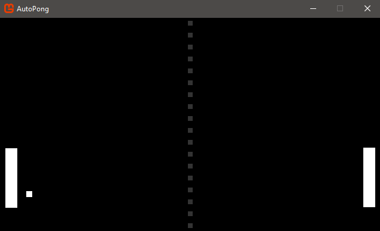

# Auto Pong Sample

This project shows you how to make the classic game of pong, with basic soundfx, in 300 lines of code.

The sample includes:

* Program Architecture: Using public static classes and fields, regions
* Basic Physics: Velocity, Position, and Collisions
* Game State Management: Keeping Score, Resetting the game
* Basic SoundFX and Music: Playing a Reset Jingle, Paddle + Scoring Soundfx, Dynamic Sound Effect Instances

## Player Controls

AutoPong plays itself, so no player input is needed. You can change the code to accept player input, as an exercise.

## Exploring the Sample

* AutoPong doesn't load any content (pngs, wavs, etc...), instead content is created via code.
* AutoPong is designed using 3 classes: AutoPongGame, AudioSource, and WaveType.
* The AutoPongGame class is the expected Game class.
* An AudioSource class is used to make soundfx and music, which utilizes the WaveType for producing different sounds.
* The simulation and all its controls are built in to the "Update" loop, moving the ball, simulated paddles and win conditions.
* The draw loop does exactly what you expect and just draws all the game UI including Paddles, the Ball, score and the half-way line (dotted line). All commented for convenience.

If you fancy a challenge, play with the sound generation or even update the paddle controls in the Update loop so you can play yourself (or for the more advanced player, build a proper AI controlled bat)