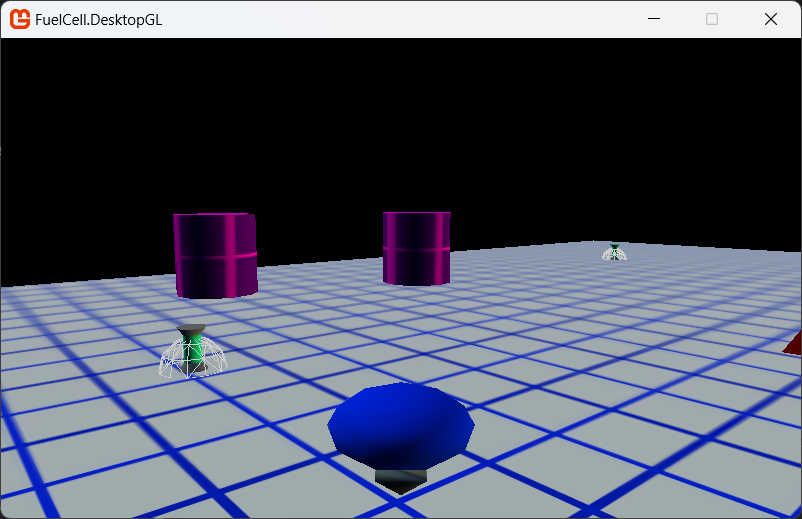
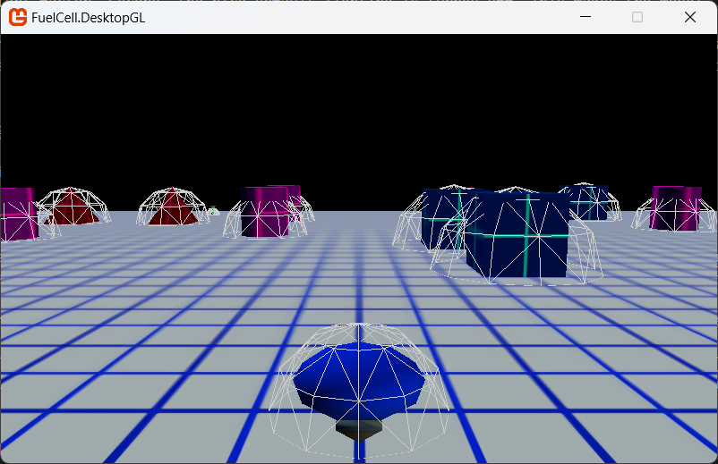
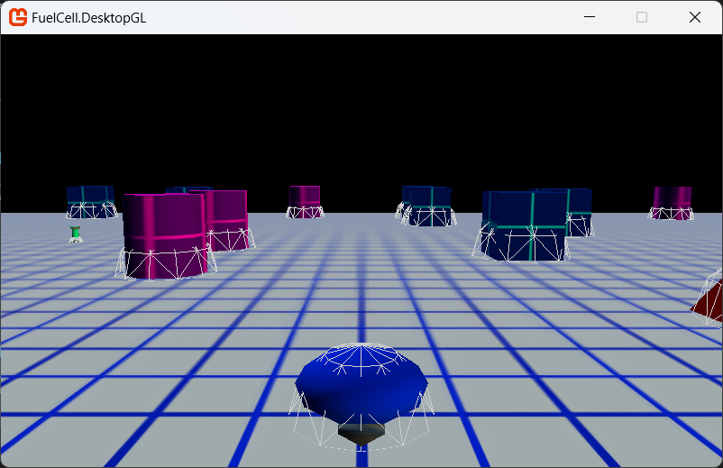

# FuelCell: "Ships" Passing in the Night

## In this article

- [Out of My Way!](#out-of-my-way)
- [Adding the Bounding Sphere Model](#adding-the-bounding-sphere-model)
- [Calculating the Boundary of the Fuel Cell Model](#calculating-the-boundary-of-the-fuel-cell-model)
- [Drawing the Spheres](#drawing-the-spheres)
- [Implementing the Remaining Bounding Spheres](#implementing-the-remaining-bounding-spheres)
- [Collision Checking for the Fuel Carrier](#collision-checking-for-the-fuel-carrier)
- [Initial Bounding Sphere Results](#initial-bounding-sphere-results)
- [See Also](#see-also)

Discusses collision detection in a 3D game and demonstrates basic collision checking between the fuel carrier vehicle and the other game objects on the playing field.

## Out of My Way!

Currently, the game is not very challenging (and impossible to win). The player can drive through barriers and fuel cells without retrieving them. The only boundaries are the edges of the playing field, added in Step 4. It's time to implement the main feature of the game: collision detection.

Collision detection is a technique used in nearly all games, whether they are 2D or 3D. It simulates (to varying degrees) the interaction of real world objects. Without collision detection, objects in the game world could be seamlessly rendered within the space of the objects with which they collide. In most cases, this is unacceptable. The player expects to "collide" with objects in the game world and not merge with them. The desired behavior in FuelCell is to allow the player free motion around the playing field as long as he or she avoids the barriers. However, if the player attempts to drive through any part of a barrier, the player's current motion stops. Players must drive around the barriers, as they would in the real world. The behavior for fuel cells is a bit different. When a player "collides" with a fuel cell, the fuel cell object is marked as retrieved and no longer is drawn in the game world. This simulates the retrieval of the fuel cell. In the final step, the game display tracks these retrievals. The game ends when the player retrieves all the fuel cells.

FuelCell's implementation of collision detection is based on the [BoundingSphere](https://monogame.net/api/Microsoft.Xna.Framework.BoundingSphere.html) class and the following article: [How To: Detect Whether Two Models Collide](). Collison detection with bounding spheres is a good approach for a variety of reasons:

- Bounding spheres (in addition to bounding boxes and frustums) are already available (courtesy of the XNA Framework) for use in your code.
- Bounding spheres do not have to be rotated if the enclosed object is rotated. This is not true when using bounding boxes or frustums. This saves some coding and reduces the complexity of the implementation.
- Bounding spheres are automatically generated for sub-meshes by the XNA Framework. Each mesh has a related bounding sphere, accessible with the BoundingSphere property of the ModelMesh object.

It is time to dive back into the code and take advantage of some of these features as we implement the collision detection.

## Adding the Bounding Sphere Model

During development, it's incredibly useful to render your bounding spheres along with its related model. This makes debugging the collision detection code much easier when things don't seem to be working properly. FuelCell represents the bounding sphere as a spherical wire-frame model, whose radius is 1 unit. When rendering the bounding sphere of a model, it is easily scaled (using the radius of the model's bounding sphere) and placed by setting the bounding sphere's center to the current position of the model.

For example, if the radius of the bounding sphere of a mesh is 4, the bounding sphere model is scaled by 4, which matches the size of the original bounding sphere.

In order to use this technique, you need to add and initialize a spherical model with a radius of 1 unit. Luckily, the sphere1uR.x model is the model you need.

1. Add the [sphere1uR.x](../FuelCell.Core/Content/Models/sphere1uR.x) and [White.png](../FuelCell.Core/Content/Models/White.png) files to the `Models` directory of the FuelCell MGCB Content project.

2. In `FuelCellGame.cs`, declare a member variable (called `boundingSphere`) of type `GameObject`, after the declaration of the game camera.

    ```csharp
    GameObject boundingSphere;
    ```

3. In the existing `Initialize` method, initialize the new variable after initializing the game camera:

    ```csharp
    boundingSphere = new GameObject();
    ```

4. In the existing `LoadContent` method, load the bounding sphere model after loading of the ground model:

    ```csharp
    boundingSphere.Model = Content.Load<Model>("Models/sphere1uR");
    ```

Once the model is loaded, you can use it to render the bounding spheres of your game objects. The only data you will need to track is the size and position of each object's bounding sphere. For FuelCell, there are three types of bounding spheres: `fuel carrier`, `fuel cell`, and `barrier`. You can use the bounding sphere model for each type as long as you scale and position the model before rendering it. For simplicity's sake, the rendering code for a game object and its bounding sphere are kept together. Because the procedure for doing this is the same for both fuel cells and barriers, you will only walk through the fuel cell side of things. After that, we'll discuss the barrier implementation at a higher level.

## Calculating the Boundary of the Fuel Cell Model

Do you remember the member variable you added previously to the GameObject class, BoundingSphere? This is the step that finally makes use of that variable, with the help of a bit of code. The first step involves calculating a decent approximation of the bounding sphere of the game object's model. We'll use the CreateMerged method. It's a quick and cheap way to calculate the bounding spheres of simple models. We will start with the initial bounding sphere and, for every two spheres encountered in the model, we will merge them. This continues until no more bounding spheres are left.

> [!NOTE]
> For single mesh models, like those in FuelCell, this approach works perfectly. However, the approach begins to lose accuracy when applied to a complex model. This is why there are entire shelves of books devoted to solving this problem at your local bookstore.

This helper function `CalculateBoundingSphere` approximates the bounding sphere of a model and then returns a new bounding sphere that envelops the model. The result is stored in the BoundingSphere variable. The Y-coordinate is set to 0. This causes the upper half of the bounding sphere to project out of the playing field. Since the widest part of the sphere is at the playing field level, it provides a good approximation when testing collision between fuel cells and the fuel carrier.

Open the `GameObject` class and add the helper method after any existing code:

```csharp
protected BoundingSphere CalculateBoundingSphere()
{
    BoundingSphere mergedSphere = new BoundingSphere();
    BoundingSphere[] boundingSpheres;
    int index = 0;
    int meshCount = Model.Meshes.Count;

    boundingSpheres = new BoundingSphere[meshCount];
    foreach (ModelMesh mesh in Model.Meshes)
    {
        boundingSpheres[index++] = mesh.BoundingSphere;
    }

    mergedSphere = boundingSpheres[0];
    if ((Model.Meshes.Count) > 1)
    {
        index = 1;
        do
        {
            mergedSphere = BoundingSphere.CreateMerged(mergedSphere, boundingSpheres[index]);
            index++;
        } while (index < Model.Meshes.Count);
    }
    mergedSphere.Center.Y = mergedSphere.Radius / 2;
    return mergedSphere;
}
```

We will also add an additional method that will enable us to draw the bounding spheres attached to a GameObject which we will take advantage of in the next section, so add the following `DrawBoundingSphere` method after the `CalculateBoundingSphere` method we just added:

```csharp
internal void DrawBoundingSphere(Matrix view, Matrix projection, GameObject boundingSphereModel)
{
    Matrix scaleMatrix = Matrix.CreateScale(BoundingSphere.Radius);
    Matrix translateMatrix = Matrix.CreateTranslation(BoundingSphere.Center);
    Matrix worldMatrix = scaleMatrix * translateMatrix;

    foreach (ModelMesh mesh in boundingSphereModel.Model.Meshes)
    {
        foreach (BasicEffect effect in mesh.Effects)
        {
            effect.World = worldMatrix;
            effect.View = view;
            effect.Projection = projection;
        }
        mesh.Draw();
    }
}
```

At this point, the bounding sphere has an approximate center (clamped to 0 on the Y axis) and radius. Remember the code you added in [Step 5: What is my Line](5-FuelCell-What-is-my-line.md) that placed the fuel cells and barriers? After adding the bounding sphere calculation code, the approximated bounding sphere now has the proper coordinates of the related model. In the next step, you will add code to render both fuel cells and their bounding spheres.

## Drawing the Spheres

Returning to the `FuelCell.cs` class, since we need the bounding sphere values from the model's sub-meshes, a good place for the initial calculation of this variable is in the `LoadContent` of the fuel cell GameObject. Add the following code after any existing code in the `LoadContent` method:

```csharp
BoundingSphere = CalculateBoundingSphere();
```

This gives us the bounding sphere for the `FuelCell` GameObject that we can then use in the rest of our project.

Switching over to the `FuelCellGame.cs` class, we can start updating how we draw the FuelCells, including the new BoundingSphere functionality we just added (although, that is not their real purpose).  In the Draw function, replace the existing `foreach` loop that draws the fuel cells with the following:

```csharp
foreach (FuelCell fuelCell in fuelCells)
{
    if (!fuelCell.Retrieved)
    {
        fuelCell.Draw(gameCamera.ViewMatrix, gameCamera.ProjectionMatrix);
        // Prepare the Graphics Device to draw in Wireframe mode instead of the default Solid/Textured
        graphics.GraphicsDevice.RasterizerState = ChangeRasterizerState(FillMode.WireFrame);
        // Draw the Bounding Sphere
        fuelCell.DrawBoundingSphere(gameCamera.ViewMatrix, gameCamera.ProjectionMatrix, boundingSphere);
        // Reset the Graphics Device drawing mode to solid/textured
        graphics.GraphicsDevice.RasterizerState = ChangeRasterizerState(FillMode.Solid);
    }
}
```

What is new about this code? The most important changes are the graphics device state changes and the call to `DrawBoundingSphere` of the GameObject. The state changes are necessary to render the sphere model as a white wireframe model. We did this for two reasons:

- So that the underlying model would not be obscured, and the bounding sphere model would be easily visible when drawn. The switch to wireframe rendering is made by setting the [RasterizerState](https://monogame.net/api/Microsoft.Xna.Framework.Graphics.RasterizerState.html) `FillMode` Property to `FillMode.WireFrame`. Once the sphere model is drawn, the fill mode is set back to the default, `FillMode.Solid`.
- The second change is the call to the new draw function of the `GameObject` class, `DrawBoundingSphere`.

Changing the drawing mode of the [GraphicsDevice](https://monogame.net/api/Microsoft.Xna.Framework.Graphics.GraphicsDevice.html) requires changing the [RasterizerState](https://monogame.net/api/Microsoft.Xna.Framework.Graphics.RasterizerState.html) and to make this easier, we add a `ChangeRasterizerState` method to create the new state using the code below, which you can add straight after the `Draw` Method:

```csharp
private RasterizerState ChangeRasterizerState(FillMode fillmode, CullMode cullMode = CullMode.None)
{
    RasterizerState rasterizerState = new RasterizerState();
    rasterizerState.CullMode = cullMode;
    rasterizerState.FillMode = fillmode;
    return rasterizerState;
}
```

Even though the two drawing methods are similar, there are some important differences. First, the bounding sphere model is scaled using the radius of the fuel cell's bounding sphere instead of a constant factor. Second, the nice default lighting is turned off. This makes the model "pop" a bit more amidst the other models rendered with default lighting.

At this point, rebuild the game and start it. You'll notice that the fuel cells now have wireframe spheres surrounding them. You'll also notice that the spheres are pretty bad approximations of the fuel cell's boundaries. We'll get to that eventually. For now, let's add the code that updates and renders the bounding spheres for the fuel carrier and barriers.



## Implementing the Remaining Bounding Spheres

First update the barrier-related code since the barriers do not move, which results in less code to write.

- In the `Barrier.cs` class, modify the `LoadContent` method to calculate the [initial bounding sphere](#drawing-the-spheres).
- In the `FuelCellGame.cs` class, update the `Draw` method to modify the foreach loop that draws the barriers to also draw the related bounding sphere.

Next, update the fuel carrier in the same way, which is the same procedure except for some extra code at the end to handle vehicle movement and fuel cell collision.

- In the `FuelCarrier.cs` class, modify the `LoadContent` method to calculate the [initial bounding sphere](#drawing-the-spheres).
- In the `FuelCarrier.Update` method, update the bounding sphere location with the future position of the fuel carrier.

    ```csharp
    if (ValidateMovement(futurePosition, barriers))
    {
        Position = futurePosition;
        
        BoundingSphere updatedSphere;
        updatedSphere = BoundingSphere;
        
        updatedSphere.Center.X = Position.X;
        updatedSphere.Center.Z = Position.Z;
        BoundingSphere = new BoundingSphere(updatedSphere.Center, updatedSphere.Radius);
    }
    ```

- In the `Draw` method, modify the fuel carrier draw code to also draw the related bounding sphere.

This completes the modifications to draw all the bounding spheres. If you rebuild and run the game, you will now see lots of wire-frame spheres. But there is still more work (related to fuel carrier collision detection) to make these bounding spheres useful. At this point, the fuel carrier still ignores the fuel cell and barrier bounding spheres. Let's fix this now.

## Collision Checking for the Fuel Carrier

There are two collision events that need implementation:

- Collision with a fuel cell - when the fuel carrier/player runs through a fuel cell.
- Collision with a barrier - when the fuel carrier/player hits a barrier and should not be able to move any further forward.

If you remember, you already implemented the playing field edge collision code in the `ValidatePosition` method of the `FuelCellGame.cs` class.

Fuel cell collision is important because that it is the only way the player can score points and win the game. You need to add code that checks for collisions between a fuel cell and the fuel carrier. If they collide, you need to mark the fuel cell as retrieved, update the retrieved fuel cells counter, and not draw the fuel cell in the future. This gives the impression that the fuel cell has been picked up by the fuel carrier.

Begin by modifying the `FuelCellGame.Update` method to check for collision between the fuel cell and the fuel carrier. Add the following code after the game camera update:

```csharp
foreach (FuelCell fuelCell in fuelCells)
{
    fuelCell.Update(fuelCarrier.BoundingSphere);
}
```

And add the `FuelCell.Update` method, called with the preceding code. Place it after the `Draw` method in the `FuelCell.cs` class:

```csharp
internal void Update(BoundingSphere vehicleBoundingSphere)
{
    if (vehicleBoundingSphere.Intersects(this.BoundingSphere))
    {
        this.Retrieved = true;
    }
}
```

This checks for intersection between the bounding spheres of the carrier and the fuel cell. This is the essence of the procedure discussed in [How To: Detect Whether Two Models Collide]().

Go ahead and remove the now-redundant check (located in `FuelCell.Draw`) to see if the fuel cell is retrieved before drawing. That check is now being made in the FuelCellGame.Draw method. This completes the code support for the first collision event.

Replacing:

```csharp
if (!Retrieved)
{
    foreach (ModelMesh mesh in Model.Meshes)
    {
        foreach (BasicEffect effect in mesh.Effects)
        {
            effect.World = worldMatrix;
            effect.View = view;
            effect.Projection = projection;

            effect.EnableDefaultLighting();
            effect.PreferPerPixelLighting = true;
        }
        mesh.Draw();
    }
}
```

With:

```csharp
foreach (ModelMesh mesh in Model.Meshes)
{
    foreach (BasicEffect effect in mesh.Effects)
    {
        effect.World = worldMatrix;
        effect.View = view;
        effect.Projection = projection;

        effect.EnableDefaultLighting();
        effect.PreferPerPixelLighting = true;
    }
    mesh.Draw();
}
```

The second event requires less code because, for the most part, the infrastructure already exists. The existing `ValidateMovement` method will be updated to check for barrier collision in addition to game field boundary collision.

First we need to add a new method to the `FuelCarrier.cs` class to be able to check if the player impacts with any of the barriers, adding the following `CheckForBarrierCollision` method at the end of the class:

```csharp
private bool CheckForBarrierCollision(BoundingSphere vehicleBoundingSphere, Barrier[] barriers)
{
    for (int curBarrier = 0; curBarrier < barriers.Length; curBarrier++)
    {
        if (vehicleBoundingSphere.Intersects(barriers[curBarrier].BoundingSphere))
            return true;
    }
    return false;
}
```

With that in place, we need to update the `ValidateMovement` method to both update its bounding sphere (used for testing the collision) position with the players future position, and also add a check if the player is "going" to hit barrier and prevent them moving if they will:

```csharp
private bool ValidateMovement(Vector3 futurePosition, Barrier[] barriers)
{
    BoundingSphere futureBoundingSphere = BoundingSphere;
    futureBoundingSphere.Center.X = futurePosition.X;
    futureBoundingSphere.Center.Z = futurePosition.Z;

    //Do not allow off-terrain driving
    if ((Math.Abs(futurePosition.X) > MaxRange) || (Math.Abs(futurePosition.Z) > MaxRange))
    {
        return false;
    }

    //Do not allow driving through a barrier
    if (CheckForBarrierCollision(futureBoundingSphere, barriers))
    {
        return false;
    }

    return true;
}
```

The flow of this method is now as follows:

1. Update the position of the BoundingSphere to the proposed position of the player.
2. Check if the fuel carrier is going to go "out of bounds" (outside the play area) and prevents movement if it is going to.
3. Check if the fuel carrier is going to impact with any of the barriers in the game area and prevent movement if it is going to.

These constraints ensure the player can only move if they are allowed to.

## Initial Bounding Sphere Results



Once you rebuild and run FuelCell, look at the size of the default bounding spheres. For each object, the bounding sphere is quite large. In some cases, the addition of bounding sphere volumes creates situations where the code prevents the vehicle from passing through barriers that are far enough apart for the vehicle itself. The collision detection, as it stands now, is pretty good considering that this is the result if you do nothing but use the default bounding sphere parameters. However, with a simple modification to the code we can improve the experience of the player. The modification involves applying another scaling factor to the bounding spheres of each game object. This allows realistic interaction between the vehicle and the game world.

The implementation requires scaling factors for each object type. A good place for these is in the GameConstants.cs file. Add the following declarations to the end of the `GameConstants` class:

```csharp
//bounding sphere scaling factors
public const float FuelCarrierBoundingSphereFactor = .8f;
public const float FuelCellBoundingSphereFactor = .5f;
public const float BarrierBoundingSphereFactor = .7f;
```

There are factors for the fuel carrier, fuel cells, and barriers.

The second modification is to the `LoadContent` methods of the fuel carrier, fuel cell, and barrier classes. After the bounding sphere is first calculated, the radius is then modified by the appropriate factor. This shrinks the radius of the bounding sphere, creating a tighter fit with the object's visible boundary.

Modify the `FuelCell.LoadContent` method by adding the following code after the bounding sphere calculation:

```csharp
BoundingSphere scaledSphere;
scaledSphere = BoundingSphere;
scaledSphere.Radius *= GameConstants.FuelCellBoundingSphereFactor;
BoundingSphere = new BoundingSphere(scaledSphere.Center, scaledSphere.Radius);
```

Modify the `FuelCarrier.LoadContent` method by adding the following code after the bounding sphere calculation:

```csharp
BoundingSphere scaledSphere;
scaledSphere = BoundingSphere;
scaledSphere.Radius *= GameConstants.FuelCarrierBoundingSphereFactor;
BoundingSphere = new BoundingSphere(scaledSphere.Center, scaledSphere.Radius);
```

Modify the `Barrier.LoadContent` method by adding the following code after the bounding sphere calculation:

```csharp
BoundingSphere scaledSphere;
scaledSphere = BoundingSphere;
scaledSphere.Radius *= GameConstants.BarrierBoundingSphereFactor;
BoundingSphere = new BoundingSphere(scaledSphere.Center, scaledSphere.Radius);
```

Rebuild and run the game. The bounding spheres are noticeably smaller, and they no longer enclose the game models. However, the important area (a band on the ground going around the game object) matches the outline of the model fairly accurately. At this point, the collision detection is good enough for our purposes. However, with a little effort, the placement and size of the bounding spheres could be modified even further to produce more accurate collision detection. Like most things in game development, the more time you spend on a feature, the better it gets (remember that trilemma we discussed earlier?). There's one more step before we can call it done. In the last step, we'll add some new screens (for example, start, win or lose), game state tracking and HUD elements, and a few other items.



## See Also

### Conceptual

- [FuelCell: Introduction](../README.md)

### Tasks

- [How To: Detect Whether Two Models Collide]()