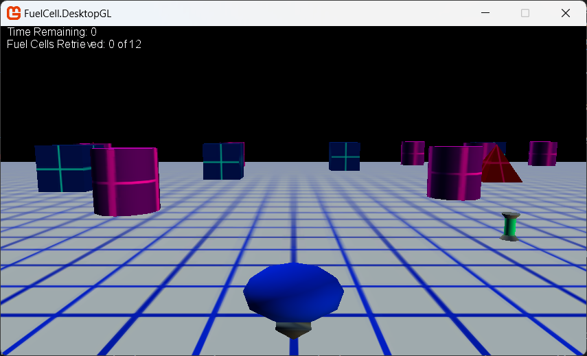

# FuelCell: Finishing Touches

## In this article

- [Overview of Game State Management](#overview-of-game-state-management)
- [Anybody Got the Time?](#anybody-got-the-time)
- [Gimme a T!](#gimme-a-t)
- [The State of Things](#the-state-of-things)
- [Implementing the Loading Game State](#implementing-the-loading-game-state)
- [Implementing the Running (Gameplay) Screen](#implementing-the-running-gameplay-screen)
- [Implementing the Game Won/Game Lost Screens](#implementing-the-game-wongame-lost-screens)
- [That's a Wrap!](#thats-a-wrap)
- [See Also](#see-also)

Discusses the final steps in the development of the FuelCell game.

## Overview of Game State Management

As a game, FuelCell is nearly complete, but we are missing some important features. These features include:

- Game state management
- Start and win/loss screens
- Game status display (such as the current score and time remaining)

Game state management is the management of different states of the game through displaying different screens and/or by logic code added to the existing code. Common states for a basic game include: starting, playing, win/loss, and pause. Each of these states could have one or more related screens, such as an options screen or a gameplay screen.

>[!TIP]
> The full [GameState Management](https://github.com/SimonDarksideJ/GameStateManagementSample) sample is available on GitHub for reference and as a library for use in your own games, [here](https://github.com/SimonDarksideJ/GameStateManagementSample).

FuelCell manages three states (**starting**, **playing**, **won/lost**) and three different screens:

- A starting screen with instructions on playing the game
- A gameplay screen displaying the fuel carrier and the playing field – the screen we have been working on from the beginning
- A screen that informs whether the player won or lost, and enables the player to start a new game or exit

The game state management code is confined to the `FuelCellGame.cs` file (with some constants defined in `GameConstants.cs`). Heavy modification of the `Update` and `Draw` methods are needed, and some additional new code will be added in various areas of the file.

However, before we start that work, we will remove the code that renders the bounding spheres. It has served its purpose and only gets in the way now. In the `Draw` method, comment out (or remove) all code that sets the wire frame rendering mode and calls the `DrawBoundingSphere` method. Rebuild the game and run it. Without all the wireframe spheres, it looks like a real game. (The sample has these left in but commented out for reference)

> [!NOTE]
> If this were a real game in development, you would either remove these calls completely or enclose them in DEBUG conditionals. In addition, you could remove or conditionalize the code around initializing and loading the bounding sphere model (boundingSphere). However, you still need the remaining code initializing and calculating the bounding spheres for the various game objects. Without it, our collision detection disappears.
>
> For our purposes, a simple commenting out suffices.

## Anybody Got the Time?

One of the goals of FuelCell is to collect 12 fuel cells. It is not a very difficult task if the player has all the time in the world. Let us fix that now by adding a time limit to the game. The player starts with a set amount of time. In this case, we will use 30 seconds. If the player collects all 12 fuel cells before time runs out, the player wins the game. However, if time runs out and there are still fuel cells on the playing field, the player loses. The winning and losing conditions are handled by the game state management code that you will add later. For now, let us implement the time limit feature.

To create a default for how long a round should last, we will define a new Constant in `GameConstants.cs`, The `RoundTime` variable is then set to 30.25 seconds. The .25 seconds is to give enough time to flash 30 on the screen before it begins counting down.

```csharp
public static readonly TimeSpan RoundTime = TimeSpan.FromSeconds(30.25);
```

In `FuelCellGame.cs`, declare three variables (of type [TimeSpan](https://msdn.microsoft.com/en-us/library/system.timespan.aspx)) for the various times to be tracked. You will also need a variable for tracking the number of retrieved fuel cells (of type int).

```csharp
int retrievedFuelCells = 0;
TimeSpan startTime, roundTimer, roundTime;
```

In the `FuelCellGame` constructor, add initialization code for the starting and round times. This code sets the start and game time variables to 0. Zero indicates the game has not started using the constant we defined earlier.

```csharp
roundTime = GameConstants.RoundTime;
```

While you are in the constructor, also add the following code to specify a resolution of 853x480. This resolution causes output from any console to look good, regardless of the widescreen capabilities of the output device.

```csharp
graphics.PreferredBackBufferWidth = 853;
graphics.PreferredBackBufferHeight = 480;
```

Next, in the `Update` method, add the following code that sets the time variables to their proper values when the player presses the `Start` button on the gamepad. A good place for this code is after the code that checks for pressing of the Exit button:

```csharp
if (currentGamePadState.Buttons.Start == ButtonState.Pressed)
{
    roundTimer = roundTime;
}
```

This code sets the current and start times to the current total game time, and then calculates the end time. Now that the time is set, you will need to track the amount of elapsed game time.

Staying in the same method, add the following code after the fuel cell update code:

```csharp
      roundTimer -= gameTime.ElapsedGameTime;
```

## Gimme a T!

Next, you will need to implement a simple HUD that displays the remaining time and the number of retrieved fuel cells during gameplay. We will accomplish this by using the technique described by [How To: Draw Text]().

The first item is a [spritefont](https://monogame.net/api/Microsoft.Xna.Framework.Graphics.SpriteFont.html) for the screen text. This is a new content type for the game, so add a new directory in the MGCB editor called `Fonts` (`Edit -> Add -> New Folder`), and then select that folder and add a new Spritefont item to that directory called `StatsFont` (`Right-Click folder -> Add -> New Item -> SpriteFont Description`).  This will result in a new default [spritefont](https://monogame.net/api/Microsoft.Xna.Framework.Graphics.SpriteFont.html) definition in your Content Project.

> [!NOTE]
> For more information on how SpriteFonts are created and used, including how to change the font and size, then check out the [WhatIs:SpriteFont]() guide.

Next. in the GameConstants.cs file, add the following strings:

```csharp
// Display Text
public const string StrTimeRemaining = "Time Remaining: ";
public const string StrCellsFound = "Fuel Cells Retrieved: ";
public const string StrGameWon = "Game Won !";
public const string StrGameLost = "Game Lost !";
public const string StrPlayAgain = "Press Enter/Start to play again or Esc/Back to quit";
public const string StrInstructions1 = "Retrieve all Fuel Cells before time runs out.";
public const string StrInstructions2 = "Control ship using keyboard (A, D, W, S) or the left thumbstick.";
```

These strings are used in various screens to display information on how to play, the current time remaining, and other important stuff. You will also need a sprite batch and a sprite font variable when drawing the game text. Add these in the `FuelCellGame.cs` file after the `graphics` variable declaration (replacing the existing SpriteBatch declaration if there is one):

> [!NOTE]
> The default MonoGame project template includes `GraphicsDeviceManager` and `SpriteBatch` properties by default.

```csharp
SpriteBatch spriteBatch;
SpriteFont statsFont;
```

In the `LoadContent` method, initialize the `spritebatch` object, and load the new `spritefont` with the following code:

```csharp
spriteBatch = new SpriteBatch(GraphicsDevice);
statsFont = Content.Load<SpriteFont>("Fonts/StatsFont");
```

> [!NOTE]
> The default MonoGame project template includes the `new SpriteBatch` initializer by default, so feel free to update/overwrite that one if it exists.

You will use a single method, called from `Draw`, to draw all the game statistics on the gameplay screen. In the `FuelCellGame.cs` file, add the following method after the `DrawTerrain` method:

```csharp
private void DrawStats()
{
    float xOffsetText, yOffsetText;
    string str1 = GameConstants.StrTimeRemaining;
    string str2 = GameConstants.StrCellsFound + retrievedFuelCells.ToString() + " of " + GameConstants.NumFuelCells.ToString();
    Rectangle rectSafeArea;

    str1 += (roundTimer.Seconds).ToString();

    //Calculate str1 position
    rectSafeArea = GraphicsDevice.Viewport.TitleSafeArea;

    xOffsetText = rectSafeArea.X;
    yOffsetText = rectSafeArea.Y;

    Vector2 strSize = statsFont.MeasureString(str1);
    Vector2 strPosition = new Vector2(xOffsetText + 10, yOffsetText);

    spriteBatch.Begin();
    spriteBatch.DrawString(statsFont, str1, strPosition, Color.White);
    strPosition.Y += strSize.Y;
    spriteBatch.DrawString(statsFont, str2, strPosition, Color.White);
    spriteBatch.End();

    //re-enable depth buffer after sprite batch disablement
    GraphicsDevice.DepthStencilState = DepthStencilState.Default;
    GraphicsDevice.BlendState = BlendState.Opaque;
    GraphicsDevice.RasterizerState = RasterizerState.CullCounterClockwise;
    GraphicsDevice.SamplerStates[0] = SamplerState.LinearWrap;
}
```

There is a fair bit of code here. The first part sets up the locations where the game statistic strings are drawn. Following the approach used by [How To: Draw a Sprite](). You always need to keep in mind with regards to your rendering to keep it within 90% of the screen to avoid any sprites being drawn in areas of the screen that could get cut off by a TV display. The next part composes the strings with the current game info, and then draws them on the gameplay screen. However, the last bit of code deserves more examination.

You must reset certain properties of the graphics device whenever you combine sprite drawing with 3D rendering, as FuelCell does. These properties, related to alpha blending and the depth buffer, are set to different values when a sprite batch is used. If the properties are not reset to the default settings, weird rendering issues could suddenly appear in your game. That is why the final code modifies some RenderState and SampleStates properties of the graphics device.

To finish this section, you will need to call the `DrawStats` method to the existing `Draw` method. Add the following code after the call to `FuelCarrier.Draw()`. (before the `base.Draw(gameTime);` call)

```csharp
DrawStats();
```

After a rebuild, the time and remaining number of fuel cells are displayed in the upper-left corner. Of course, the values are completely wrong, but we will be fixing those next.



## The State of Things

The remaining code you will add implements the game state management of FuelCell. As mentioned previously, one of the main duties of game state management is to determine the correct game screen to display. In addition, game state management can also monitor the player's progress toward his or her goals. For FuelCell, the goals are to retrieve all fuel cells before time runs out. If the player succeeds, we need to display a Game Won screen or, conversely, a Game Lost screen. In addition, we will display a splash screen on startup of the game containing instructions for starting a new game and playing it.

> [!NOTE]
> This section of the tutorial does radically change around some of the code, so time to tighten that belt and get coding.
>
> Alternatively, you can always look to implement the library from the [GameStateManagement](https://github.com/SimonDarksideJ/GameStateManagementSample) sample if you are feeling brave!

The state of the game changes depending on player input and events in the game. This makes the `Update` method an ideal place to monitor and control the varying states. In addition, the `Draw` method will be modified to properly reflect the current stage the game is in by drawing the proper screen.

Let us begin by declaring a new enumeration in the `FuelCellGame.cs` class that lists the different game states being tracked. Add the following `GameState` enumeration declaration before the `FuelCellGame` class definition:

```csharp
namespace FuelCell
{
    /// <summary>
    /// The available states of the game
    /// </summary>
    public enum GameState { Loading, Running, Won, Lost }

    /// <summary>
    /// This is the main type for your game
    /// </summary>
    public class FuelCellGame : Game
    {
```

Now add a variable (of type `GameState`) after the declaration of the `random` variable.

```csharp
GameState currentGameState = GameState.Loading;
```

We are going to implement the game state change in stages, with the first stage being the Loading state. The first part, setting the current game state to Loading, is already done in the code above.

## Implementing the Loading Game State

Before the player starts a new game of FuelCell, the player will need some basic instructions for controlling the vehicle and the win conditions. We will deliver these instructions in a splash screen, which will display when the FuelCell application begins. This screen is only displayed when the game state is in the Loading stage.

Modify the following code:

```csharp
        if ((lastKeyboardState.IsKeyDown(Keys.Enter) && (lastKeyboardState.IsKeyUp(Keys.Enter))) ||
        currentGamePadState.Buttons.Start == ButtonState.Pressed)
        {
          roundTimer = roundTime;
        }
```

to match the following:

```csharp
if (currentGameState == GameState.Loading)
{
    if ((lastKeyboardState.IsKeyDown(Keys.Enter) && (currentKeyboardState.IsKeyUp(Keys.Enter))) ||
        currentGamePadState.Buttons.Start == ButtonState.Pressed)
    {
        roundTimer = roundTime;
        currentGameState = GameState.Running;
    }
}
```

The modifications now check the game state when the player presses the Enter key or Start button, and advances the game state if the current state is GameState.Loading.

Display of the splash screen is handled in the Draw method. Since the game state is based on the current value of an enumeration, we will draw the proper screen based on the current value of currentGameState.

In the Draw method, replace the existing code between the Clear call and the base Draw call with the following code:

```csharp
        switch (currentGameState)
        {
          case GameState.Loading:
            DrawSplashScreen();
            break;
        };
```

Before the player starts the game, the only thing displayed should be the splash screen. The helper method, DrawSplashScreen, clears the screen to steel blue, and then displays some informational text. Add that method after the existing DrawTerrain method:

```csharp
private void DrawSplashScreen()
{
    float xOffsetText, yOffsetText;
    Vector2 viewportSize = new Vector2(GraphicsDevice.Viewport.Width, GraphicsDevice.Viewport.Height);
    Vector2 strCenter;

    graphics.GraphicsDevice.Clear(Color.SteelBlue);

    xOffsetText = yOffsetText = 0;
    Vector2 strInstructionsSize = statsFont.MeasureString(GameConstants.StrInstructions1);
    Vector2 strPosition;
    strCenter = new Vector2(strInstructionsSize.X / 2, strInstructionsSize.Y / 2);

    yOffsetText = (viewportSize.Y / 2 - strCenter.Y);
    xOffsetText = (viewportSize.X / 2 - strCenter.X);
    strPosition = new Vector2(xOffsetText, yOffsetText);

    spriteBatch.Begin();
    spriteBatch.DrawString(statsFont, GameConstants.StrInstructions1, strPosition, Color.White);

    strInstructionsSize = statsFont.MeasureString(GameConstants.StrInstructions2);
    strCenter = new Vector2(strInstructionsSize.X / 2, strInstructionsSize.Y / 2);
    yOffsetText = (viewportSize.Y / 2 - strCenter.Y) + statsFont.LineSpacing;
    xOffsetText = (viewportSize.X / 2 - strCenter.X);
    strPosition = new Vector2(xOffsetText, yOffsetText);

    spriteBatch.DrawString(statsFont, GameConstants.StrInstructions2, strPosition, Color.LightGray);
    spriteBatch.End();

    //re-enable depth buffer after sprite batch disablement
    GraphicsDevice.RenderState.DepthBufferEnable = true;
    GraphicsDevice.RenderState.AlphaBlendEnable = false;
    GraphicsDevice.RenderState.AlphaTestEnable = false;
    GraphicsDevice.SamplerStates[0].AddressU = TextureAddressMode.Wrap;
    GraphicsDevice.SamplerStates[0].AddressV = TextureAddressMode.Wrap;
}
```

That completes the splash screen implementation.


Figure 1.  Splash Screen for FuelCell

## Implementing the Running (Gameplay) Screen

The next game state you will implement is the gameplay screen (the screen that you developed in Steps 3-6). This screen is reached after the player presses the Enter key or the Start button from the splash screen. You will add code to the Update and Draw methods to draw this screen at the appropriate time.

In the Update method, replace the following code:

```csharp
          fuelCarrier.Update(currentGamePadState, currentKeyboardState, barriers);
          float aspectRatio = graphics.GraphicsDevice.Viewport.AspectRatio;
          gameCamera.Update(fuelCarrier.ForwardDirection, fuelCarrier.Position, aspectRatio);

          foreach (FuelCell fuelCell in fuelCells)
          fuelCell.Update(fuelCarrier.BoundingSphere);
          roundTimer -= gameTime.ElapsedGameTime;
```

with the following code:

```csharp
if ((currentGameState == GameState.Running))
{
    fuelCarrier.Update(currentGamePadState, currentKeyboardState, barriers);
    gameCamera.Update(fuelCarrier.ForwardDirection, fuelCarrier.Position, aspectRatio);
    retrievedFuelCells = 0;
    foreach (FuelCell fuelCell in fuelCells)
    {
        fuelCell.Update(fuelCarrier.BoundingSphere);
        if (fuelCell.Retrieved)
        {
            retrievedFuelCells++;
        }
    }
    if (retrievedFuelCells == GameConstants.NumFuelCells)
    {
        currentGameState = GameState.Won;
    }
    roundTimer -= gameTime.ElapsedGameTime;
    if ((roundTimer < TimeSpan.Zero) && (retrievedFuelCells != GameConstants.NumFuelCells))
    {
        currentGameState = GameState.Lost;
    }
}
```

In the Draw method, add the following code after the existing game state check:

```csharp
case GameState.Running:
    DrawGameplayScreen();
    break;
```

And then, after the DrawSplashScreen method, add the follwoing code:

```csharp
private void DrawGameplayScreen()
{
    DrawTerrain(ground.Model);
    foreach (FuelCell fuelCell in fuelCells)
    {
        if (!fuelCell.Retrieved)
        {
            fuelCell.Draw(gameCamera.ViewMatrix, gameCamera.ProjectionMatrix);
        }
    }
    foreach (Barrier barrier in barriers)
    {
        barrier.Draw(gameCamera.ViewMatrix, gameCamera.ProjectionMatrix);
    }

    fuelCarrier.Draw(gameCamera.ViewMatrix, gameCamera.ProjectionMatrix);
    DrawStats();
}
```

At this point, the game displays both the splash and gameplay screens. Only the win/loss screen remains.


Figure 2.  Gameplay Screen for FuelCell

## Implementing the Game Won/Game Lost Screens

The win/loss screens are similar, differing only in the initial text. From either screen, the player can choose to play another game or exit FuelCell. For this reason, you will implement both screens using a single function. That function, DrawWinOrLoss, accepts a string parameter with the appropriate message.

First, let us modify the Update method to check for player input after a game. Add the following code after the check for GameState.Running:

```csharp
if ((currentGameState == GameState.Won) || (currentGameState == GameState.Lost))
{
    // Reset the world for a new game
    if ((lastKeyboardState.IsKeyDown(Keys.Enter) && (currentKeyboardState.IsKeyUp(Keys.Enter))) ||
        currentGamePadState.Buttons.Start == ButtonState.Pressed)
        ResetGame(gameTime, aspectRatio);
}
```

There is nothing of note in this code except for the call to the Reset method. It "resets" the world, allowing a new game to be played. Let us add that method now.

In FuelCellGame.cs, add the following method:

```csharp
private void ResetGame(GameTime gameTime, float aspectRatio)
{
    fuelCarrier.Reset();
    gameCamera.Update(fuelCarrier.ForwardDirection, fuelCarrier.Position, aspectRatio);
    InitializeGameField();

    retrievedFuelCells = 0;
    startTime = gameTime.TotalGameTime;
    roundTimer = roundTime;
    currentGameState = GameState.Running;
}
```

In the GameObject.cs file, after the LoadContent method, add the following method to the FuelCarrier class:

```csharp
internal void Reset()
{
    Position = Vector3.Zero;
    ForwardDirection = 0f;
}
```

This returns the fuel carrier to its original position and orientation.

The final code you will add is InitializeGameField. PLace this code after the ResetGame method (located in FuelCellGame.cs):

```csharp
private void InitializeGameField()
{
    //Initialize barriers
    barriers = new Barrier[GameConstants.NumBarriers];
    int randomBarrier = random.Next(3);
    string barrierName = null;

    for (int index = 0; index < GameConstants.NumBarriers; index++)
    {
        switch (randomBarrier)
        {
            case 0:
                barrierName = "Models/cube10uR";
                break;
            case 1:
                barrierName = "Models/cylinder10uR";
                break;
            case 2:
                barrierName = "Models/pyramid10uR";
                break;
        }
        barriers[index] = new Barrier();
        barriers[index].LoadContent(Content, barrierName);
        randomBarrier = random.Next(3);
    }
    PlaceFuelCellsAndBarriers();
}
```

This method completes the remaining tasks for a new game:

Generates new positions for all fuel cells and barriers.
Sets all fuel cells to a non-retrieved state and zeros out the number of retrieved fuel cells.
The final bit of code updates the Draw method to draw the winning or losing screen. Add the following code after the check for the Running game state in Draw:

```csharp
case GameState.Won:
    DrawWinOrLossScreen(GameConstants.StrGameWon);
    break;
case GameState.Lost:
    DrawWinOrLossScreen(GameConstants.StrGameLost);
    break;
```

Now implement the DrawWinOrLossScreen method, after the existing DrawSplashScreen method:

```csharp
private void DrawWinOrLossScreen(string gameResult)
{
    float xOffsetText, yOffsetText;
    Vector2 viewportSize = new Vector2(GraphicsDevice.Viewport.Width, GraphicsDevice.Viewport.Height);
    Vector2 strCenter;

    xOffsetText = yOffsetText = 0;
    Vector2 strResult = statsFont.MeasureString(gameResult);
    Vector2 strPlayAgainSize = statsFont.MeasureString(GameConstants.StrPlayAgain);
    Vector2 strPosition;
    strCenter = new Vector2(strResult.X / 2, strResult.Y / 2);

    yOffsetText = (viewportSize.Y / 2 - strCenter.Y);
    xOffsetText = (viewportSize.X / 2 - strCenter.X);
    strPosition = new Vector2(xOffsetText, yOffsetText);

    spriteBatch.Begin();
    spriteBatch.DrawString(statsFont, gameResult, strPosition, Color.Red);

    strCenter = new Vector2(strPlayAgainSize.X / 2, strPlayAgainSize.Y / 2);
    yOffsetText = (viewportSize.Y / 2 - strCenter.Y) + (float)statsFont.LineSpacing;
    xOffsetText = (viewportSize.X / 2 - strCenter.X);
    strPosition = new Vector2(xOffsetText, yOffsetText);
    spriteBatch.DrawString(statsFont, GameConstants.StrPlayAgain, strPosition, Color.AntiqueWhite);

    spriteBatch.End();

    //re-enable depth buffer after sprite batch disablement
    GraphicsDevice.RenderState.DepthBufferEnable = true;
    GraphicsDevice.RenderState.AlphaBlendEnable = false;
    GraphicsDevice.RenderState.AlphaTestEnable = false;
    GraphicsDevice.SamplerStates[0].AddressU = TextureAddressMode.Wrap;
    GraphicsDevice.SamplerStates[0].AddressV = TextureAddressMode.Wrap;
}
```

Since the Win and Loss screens differ only in the message, we can cheat a bit and just use the same function, passing in the game result.


Figure 3.  FuelCell Congratulatory Screen

## That's a Wrap!

After the (now) traditional rebuild and play session, you can now enjoy the introductory splash screen, a challenging game of retrieve the fuel cells, and (hopefully) a congratulatory winning screen.

At this point, the FuelCell game is complete. Even though you wrote a large amount of code, the possibilities for expansion are endless. For example:

- Multiplayer - invite a competitor and whomever collects the most fuel cells wins!
- Powerups - Add another object, or two, that gives the player a boost of speed for 5 seconds or a "ghost" ability that ignores those pesky barriers!
- Advanced lighting and effects - improve the default lighting with a glow effect or motion blur.
- Sound - add the Whoosh! of fuel carrier acceleration or the Bonk! of barrier collision.

If you need more ideas for expanding FuelCell or want to interact with a like-minded community of fellow game developers, check out XNA Creators Club Online Web site. It's an excellent community-driven site that has active forums and helpful people who are designing new and exciting games.

Good luck in your game development future and, above all, have fun!

## See Also

### Conceptual

-[FuelCell: Introduction]()

### Tasks

-[How To: Draw a Sprite]()
-[How To: Draw Text]()
