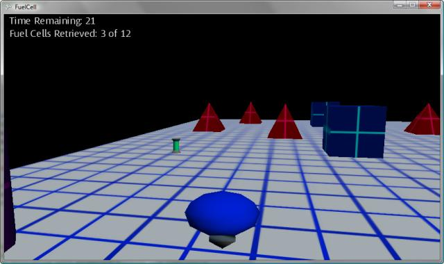

# FuelCell Example Game

The purpose of this multipart topic is to educate you about various strategies and challenges encountered during the development of a simple 3D game. The FuelCell diary focuses on developing a basic 3D game with a simple goal: collecting objects scattered randomly around a playing field that is populated with randomly placed barriers. The components of FuelCell are deliberately limited to provide a clear picture of the structure and scope of the game.

Game development is hard—especially 3D game development. MonoGame was developed specifically to make game development easier and more enjoyable. Unlike the solid content found in the [Writing Game Code]() and [Getting Started]() sections, the purpose of this diary is to provide a continuous discussion of the work required for developing a simple 3D game using MonoGame. In addition to articles focused on implementing a specific technique, this diary also contains material on initial game design and how game design drives the future development of that game. Also, since game development is not all candy and roses, the diary addresses problems encountered during development and how these problems were overcome.

FuelCell is designed around a central concept: a basic gameplay mechanism that is easily extensible. The initial version, discussed in the topics listed under [In This Section](#in-this-section) draws a random playfield of barriers and collectable objects. The player, controlling a vehicle that can be driven around the playing field, searches for a collection of fuel cells. Because the game design is modular, future versions could easily add additional effects and game features.

The primary components of FuelCell (camera, avatar control, and collision detection) use existing topics found in the [Writing Game Code](). This diary ties together these disparate concepts into a complete (albeit, simple) 3D game.

Each step in the series contains a list of important topics that are covered in the body of the topic and a link to the completed sample code of that step.

## In This Section

- [FuelCell: Game Design](Documentation/1-FuelCell-Game-design.md)
  Discusses the importance of designing a game using a feature-based approach.
- [FuelCell: Setting the Scene](Documentation/2-FuelCell-Setting-the-scene.md)
  Discusses the implementation of a playing field for the game and a simple, fixed camera.
- [FuelCell: Casting Call](Documentation/3-FuelCell-Casting-call.md)
  Discusses the implementation of the remaining game elements, such as barriers, fuel cells, and an avatar model.
- [FuelCell: What's My Motivation](Documentation/4-FuelCell-What-is-my-motivation.md)
  Discusses the implementation of user control for the avatar (known as the fuel carrier).
- [FuelCell: What's My Line?](Documentation/5-FuelCell-What-is-my-line.md)
  Demonstrates a simple, random technique for placing barriers and fuel cells on the playing field.
- [FuelCell: "Ships" Passing in the Night](Documentation/6-FuelCell-Ships-passing-in-the-night.md)
  Discusses collision detection in a 3D game and demonstrates basic collision checking between the fuel carrier vehicle and the other game objects on the playing field.
- [FuelCell: Finishing Touches](Documentation/7-FuelCell-Finishing%20Touches.md)
  Discusses some finishing touches in the development of the FuelCell game.
- [FuelCell: Brining the noise](Documentation/8-FuelCell-Bringing-the-noise.md)
  Discusses breaking the silence and making sounds and music.
- [FuelCell: It is all about the input](Documentation/9-It-is-all-about-the-input.md)
  Discusses a key factor about handling input in a game.
