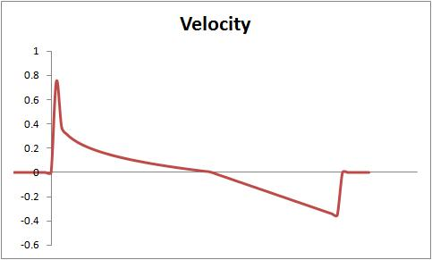
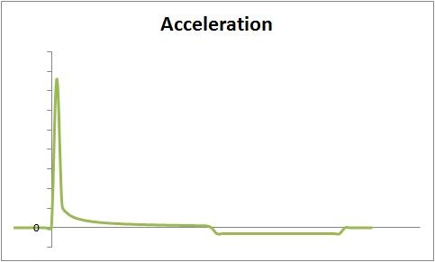

# Advanced Platformer Features

> 10 minutes to read

Discusses advanced features of the Platformer Starter Kit, and offers recommendations for modifying or extending Platformer features.

In this section, we'll explore Platformer's advanced features and the classes that implement them, such as the game levels and the player character. We'll talk about their purpose and design, and point out features that can be modified or expanded on. For information on basic classes and features, see [Exploring the Basic Classes](1_basic_platformer_features.md) and for intermediate classes and features, see [Intermediate Platformer Features](2_intermediate_platformer_features.md).

* Exploring the Advanced Classes
* Loading the Level
* Exploring Platformer's Physics
* Expanding Platformer

## Exploring the Advanced Classes

The following classes are more complex than the basic and intermediate classes, and they implement the critical features of Platformer such as the game level, the player character, and the Platformer game structure.

## PlatformerGame Class (game.cs)

The PlatformerGame class implementation is located in PlatformerGame.cs. Important methods include:

* LoadContent 
Loads the game fonts and the next level of Platformer by calling LoadNextLevel, which is another very important method. For more information on level loading, see Exploring Platformer's Physics below.

* Update 
Handles basic game input (for both keyboard and gamepad) and calls Level.Update, ... you guessed it, another very important method. For more information on level updating, see the Level class description.

* Draw 
Draws the major components of Platformer: the gameplay screen and the HUD. The gameplay screen is drawn by calling Level.Draw, which in turn draws some things and calls the Draw method of any level object smart enough to draw itself (for example, the player character).

The structure of the game is easy to follow because the majority of Platformer objects are responsible for loading, updating, and drawing themselves. The PlatformerGame class is like a conductor; it tells each object what to do and when. As discussed in the overview, the program flow can be broken up into three common steps: initializing (loading of the level, etc.), updating, and drawing. Each of these stages is discussed in detail in the appropriate class sections.

The LoadNextLevel method is an important step in the process of loading a level. This method locates and reads a physical file describing the current level. Level files are numbered sequentially, starting with 0, and stored in the ..\Content\Levels directory (in the appropriate platform/build directory). For instance, the Level 0 file for the debug Windows version of Platformer is located in the ..\Platformer\Platformer\bin\x86\Debug\Content\Levels\0 directory.

> Warning
> 
> Platformer ships with some ready-to-use levels. If you add new levels, ensure that the Copy to Output Directory property, for the related game asset, is set to true. In addition, follow the naming convention and directory structure for new levels. For instance, a new level would be in the 2 directory, underneath Levels, in the appropriate game content directory. For more information on the level structure file, see Loading the Tiles.

## Level Class
The Level class implementation is located in Level.cs. Important methods include:

* Draw 
Draws the current state of the level and its contained elements. Level tiles are drawn by calling DrawTiles. The player character, gems, and enemies are drawn by calling their respective Draw methods. 
Each level has three layers of background. These backgrounds are loaded in the Level constructor. They are drawn in order, from back to front. After all layers have been drawn, the level tiles, player character, gems, and enemies are drawn. The base implementation of Platformer uses only the leftmost segment of the background texture assets.

> Tip
> 
> For a tutorial on adding parallax scrolling to Platformer, see Platformer: Adding a Scrolling Background.

* Update 
Updates the level state, including all objects contained by the level. In addition, collision checking between objects (such as the player character and platform tiles) and the time limit for the level (includes remaining time animation) are also handled here. 
While the game is paused (either through a player death or reaching the exit), all input is ignored and the Idle animation for the enemies is played.

* LoadTiles 
Called during level construction, this method loads the level layout using a structure file previously located by PlatformerGame.LoadNextLevel. For more information on this level structure file, see Loading the Tiles.

* OnExitReached, OnPlayerKilled, and OnGemCollected 
Called from Update when important events occur in a level. These events include the player character reaching the exit, dying, or collecting a gem. Modify these to change the default behavior of these events.

## Player Class
The Player class implementation is located in Player.cs. Important methods include:

* ApplyPhysics 
Called during Player.Update, it updates the player's velocity and position based on input, gravity, and drag factors. Once position is determined, the player character is checked for collision with surrounding tiles. This is the most math-intensive method of the class, and it depends heavily on the game world physics model.

* Draw 
Orients the player correctly, and then calls AnimationPlayer.Draw to draw the current frame of the character. As mentioned elsewhere, animation frames are intentionally square. This simplifies the animation code, making it easier to understand.

* Update 
Gets input from either the keyboard or a game controller, and updates the movement and isJumping fields. The player's position and velocity are then updated by calling ApplyPhysics.

* LoadContent 
Loads the various sprite sheets and sounds used by the player character.

* HandleCollisions 
Implements collision detection between the player character and neighboring tiles.

Important properties include:

* BoundingRectangle 
Used for checking collisions between the player character and neighboring tiles and objects, like a gem or exit location. The RectangleExtensions class is an important part of the collision checking code. For more information, see RectangleExtensions class.

> Tip
> 
> Consider using per-pixel collision detection to improve the interaction between the player character and the level elements. This is an advanced extension, but it is worth the effort. For more information, download the 2D Per-Pixel Collision sample found on the [XNA game Studio Archive](https://github.com/SimonDarksideJ/XNAGameStudio/blob/master/Samples/PerPixelCollisionSample_4_0.zip), part of Collision Series 2.

* Velocity 
The velocity of the player character. This is affected by the game world physics, and it represents acceleration from running, jumping, or falling. For more information, see Platformer Physics.

## RectangleExtensions Class

This class is an extension to the MonoGame Rectangle structure. RectangleExtensions implements two methods – GetIntersectionDepth and GetBottomCenter. These methods support the conceptualization of a rectangle as a "squared circle" with two radii.

Here is what I mean. It is given that a circle has one radius; the length from the center to its perimeter. This makes intersection checking with another circle easy. If the distance between the centers is shorter than the sum of the radii, the circles intersect.

Now apply this concept to a rectangle. Imagine that a rectangle has two radii: one from the center to the height of the rectangle (the "height" radius) and another from the center to the width of the rectangle (the "width" radius). Once you know the centers of the rectangles, you can use a similar approach to check for rectangle intersection as you did earlier with the two circles. If the X-value of the distance between the centers is greater than the sum of the width radii and the Y-value of the distance between the centers is greater than the sum of the height radii, the rectangles do not intersect.

## Loading the Level

When starting a new game, the procedure for loading a level (from a program execution viewpoint) is as follows:

1. PlatformerGame.LoadContent

2. PlatformerGame.LoadNextLevel

3. Level.Level

4. Level.LoadTiles

A level can also be loaded in the following cases:

* When the player character reaches the exit of the current level. The next level is then loaded from PlatformerGame.HandleInput when the player continues the game.

* When reloading the level. This is called if time runs out. These events cause a restart of the level.

Before PlatformerGame can load the level, it must first find a physical file that contains the level structure. The LoadNextLevel method looks in the ..\Content\Levels directory (underneath the appropriate platform/build directory) for these level structure files. Once found, a new level is constructed with a call to Level.Level.

In the level constructor, the level time is initialized, the tiles are loaded (using the level structure file) and then the background textures and "exit reached" sound are loaded. The LoadTiles method is the important part here.

## Loading the Tiles

This is the workhorse of the level loading process. This method first reads in the character-based level file and verifies that all lines are the proper length. It then iterates over each line, reading the level structure from top to bottom until complete. A 2D array (composed of Tile objects) is then allocated to store each tile in the level.

At this point, the text-based lines, read from the level structure file, can be converted into actual tile layers for the current level. The LoadTile method reads a character from the current line and, based on a dictionary of characters, loads the appropriate type and game assets for the tile. The dictionary for the level structure file is as follows:

|Text Character|Description|
|-|-|
|'.'|Blank tile. This tile is TileCollision.Passable, and has no related texture.|
|'X'|Exit tile. This tile is TileCollision.Passable, and uses the Exit.png texture. The location is stored, and then the tile assets are loaded with a call to Level.LoadTile.|
|'G'|Gem tile. This tile is TileCollision.Passable, uses the Gem.png texture, and loads the tile by calling LoadGemTile. The base implementation of Platformer adds a gem to the list of gems maintained by the level, and places the gem in an blank tile.|
|''-'|Floating platform. This tile is TileCollision.Platform, and uses the Platform.png texture.|
|'A', 'B', 'C', and 'D'|Starting tile for the various Platformer enemies. This tile is TileCollision.Passable, and contains one of the four enemies used by Platformer. They differ only in appearance; an obvious place for extending the base implementation of Platformer! The base implementation of Platformer instantiates an Enemy object (adding the enemy to the level's enemies list), and places it in the level.|
|'~'|Platform block. This tile is TileCollision.Platform, and uses a randomly-chosen texture from the set of textures whose name begins with "BlockB." This tile is loaded by calling LoadVarietyTile, which is a method that randomly loads a tile texture from a subset of tile textures.
|':'|Passable block. This tile is TileCollision.Passable, and uses a randomly-chosen texture from the set of textures whose name begins with "BlockB."|
|'1'|Starting position for Player 1. This tile is TileCollision.Passable, and contains the player character. The base implementation of Platformer instantiates a Player object, and places him, facing the player, in the level. The location in the level is stored and used, in the event of player death, as a resurrection point.|
|'#'|Impassable block. This tile is TileCollision.Impassable, and uses a randomly-chosen texture from the set of textures whose name begins with "BlockA."|
|||

## Exploring Platformer's Physics

Platformer implements a basic game physics model. It is used to perform the various actions of the player character: jumping, running, and falling. The main implementation is provided by ApplyPhysics and GetJumpVelocity. Both are implemented in the Player.cs source file.

## ApplyPhysics

This method contains the bulk of the physics modeling, and is only called from Level.Update. It is responsible for computing the base velocity of the player character using horizontal movement and downward acceleration (gravity). In addition, pseudo drag is applied, gradually slowing the character down if he is running along a flat surface without input from the player. The player character also has a top running speed. Once the base velocity is computed, GetJumpVelocity is called.

## GetJumpVelocity

This method is called from ApplyPhysics and computes the Y velocity (either jumping up or falling down) of the player character.

During jump ascension, the Y velocity is overridden by a power curve, as seen below.

***Velocity Curve (over time)***

During descent, gravity controls the Y velocity and clamps at a terminal velocity. The acceleration curve is graphed below.

***Acceleration Curve (over Time)***

## Expanding Platformer

A common feature of Platformer-type games is a scrolling level. In [Platformer: Adding a Scrolling Level](3_adding_a_scrolling_level.md), you'll add a scrolling level with multiple scrolling backgrounds to the default version of the Platformer starter kit.

## Exploring the Platformer Starter Kit

* [Basic Platformer Features](1_basic_platformer_features.md) Discusses basic features of the Platformer Starter Kit and offers recommendations for making basic modifications to the Platformer game.

* [Intermediate Platformer Features](2_intermediate_platformer_features.md) Discusses intermediate classes of the Platformer Starter Kit, and offers recommendations for modifying or extending Platformer features.

* [Advanced Platformer Features](3_advanced_platformer_features.md) Discusses advanced features of the Platformer Starter Kit, and offers recommendations for modifying or extending Platformer features.
