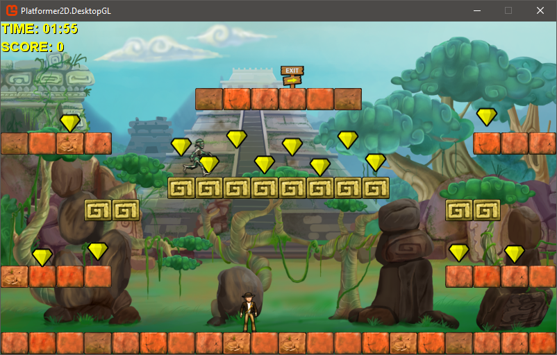

# Platformer 2D Sample

The Platformer Starter Kit is a near-complete, self-contained game solution that includes both game code and game assets. The game is a standard 2D platformer with levels, enemies, and collectable gems.

This starter kit is intentionally incomplete. Several nonessential features and systems are not finished. This makes it easier and quicker to understand the structure of the game, and how the pieces fit together to provide a rich gaming experience. The Platformer Starter Kit includes the following features:

* Cross-platform support for Windows, Android, iOS, Linux and Windows 10
* Control of the player character using either the keyboard, gamepad and virtual gamepad (for touchscreens).
* Simple physics modeling (falling and jumping) and dynamic collision checking.
* Production-level sprite sheets, sound effects, and other game assets.
* High and low resolution assets, and an additional content project containing audio assets.
* Features from MonoGame, such as the simple sound API and a unified content project that builds for each target platform.

## Player Controls

The player character is controlled using either the keyboard, gamepad or virtual gamepad .

|Action|Keyboard|Gamepad|Touchscreen|
|-|-|-|-|
|Run left, Run right|A, D|Left thumbstick or analog D-pad| Left hand touch Screen horizontal arrows|
|Jump|Space|A|Right hand touch screen up arrow|
|||||

## PLATFORMER CODE ARCHITECTURE

The following is a list of classes shipped with the Platformer starter kit. The file containing the implementation for each class shares the name of the class. For example, Gem.cs contains the Gem class implementation.

|Name|Description|
|-|-|
|Gem|Implements a floating gem in the game. Gems are collectable by the player, and are worth a set amount of points. Gems are used to load, draw, and update a gem. For more information, see [Basic Platformer Features](Documentation/1_basic_platformer_features.md).|
|Circle (structure)|Implements a bounding circle for checking collision against gem objects. For more information, see [Basic Platformer Features](Documentation/1_basic_platformer_features.md).|
|Tile (structure)|Stores basic information about a game tile. For more information, see [Basic Platformer Features](Documentation/1_basic_platformer_features.md).|
|TileCollision (enumeration)|Stores the different collision types a tile can have: Passable, Impassable, Platform. For more information, see [Basic Platformer Features](Documentation/1_basic_platformer_features.md).|
|AnimationPlayer (structure)|Implements playback of the animation stored by Animation. For more information, see [Intermediate Platformer Features](Documentation/2_intermediate_platformer_features.md).|
|Animation|Stores an animated texture. Used to animate the player character and enemy sprite sheets. For more information, see [Intermediate Platformer Features](Documentation/2_intermediate_platformer_features.md).|
|Enemy|Implements an enemy in the game. Used to load, draw, and update an enemy. For more information, see [Intermediate Platformer Features](Documentation/2_intermediate_platformer_features.md).|
|FaceDirection (enumeration)|Stores the different directions an enemy can face. For more information, see [Intermediate Platformer Features](Documentation/2_intermediate_platformer_features.md).|
|PlatformerGame (game.cs)|Implements major game components such as content and level loading, HUD management and display, and game object updating. For more information, see [Advanced Platformer Features](Documentation/3_advanced_platformer_features.md).|
|Level|Implements a level in the game. A Level object contains a multi-dimensional array of tiles, a player character, a start and end location, point total, remaining level time, a list of gems, and a list of enemies. For more information, see [Advanced Platformer Features](Documentation/3_advanced_platformer_features.md).|
|Player|Implements the player character. Used to load, draw, and update the character. For more information, see [Advanced Platformer Features](Documentation/3_advanced_platformer_features.md).|
|RectangleExtensions|Implements an extension to the standard MonoGame Framework structure Rectangle. For more information, see [Advanced Platformer Features](Documentation/3_advanced_platformer_features.md).|
|||

## Execution Flow

Think of the execution flow of Platformer as follows:

1. The next level is loaded. Important methods are PlatformerGame.LoadContent and PlatformerGame.LoadNextLevel.

2. The game is updated using PlatformerGame.Update and Level.Update. If the player is dead or if time has expired, input is ignored and the game is in a pause state. If the player has reached the exit, the remaining time is converted to points. If there is still time and the player hasn't reached the exit location, the time remaining is decremented and all level objects are updated (player character, enemies, gems, and so on) using their Update methods. At this time, checks are also made for the player reaching the exit and falling off the edge of the screen.

3. The gameplay screen is drawn using PlatformerGame.Draw. This method, in turn, calls Level.Draw and PlatformerGame.DrawHud. Level.Draw is responsible for drawing the tiles, player character, gems and enemies using calls to the Draw method of each previously-mentioned game object.

## Exploring the Platformer Starter Kit

* [Basic Platformer Features](Documentation/1_basic_platformer_features.md) Discusses basic features of the Platformer Starter Kit and offers recommendations for making basic modifications to the Platformer game.

* [Intermediate Platformer Features](Documentation/2_intermediate_platformer_features.md) Discusses intermediate classes of the Platformer Starter Kit, and offers recommendations for modifying or extending Platformer features.

* [Advanced Platformer Features](Documentation/3_advanced_platformer_features.md) Discusses advanced features of the Platformer Starter Kit, and offers recommendations for modifying or extending Platformer features.
